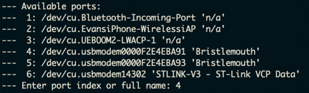

# Bristlemouth Firmware Environment Setup Instructions

## Developer Guide (in progress)
If you already have your development environment set up, check out the [DEVELOPER.md](DEVELOPER.md) file for some quick start guides, etc...

## Initial setup
### Install conda

[Conda](https://docs.conda.io/en/latest/) is used to manage dependencies (compiler, openocd, cmake, python) so that everyone has the same version of all the tools (without affecting the rest of your system).

If you don't have conda installed, follow these steps:

```
$ cd /tmp
# Download for Mac:
$ wget https://repo.anaconda.com/miniconda/Miniconda3-latest-MacOSX-x86_64.sh
# Download for Linux:
$ wget https://repo.anaconda.com/miniconda/Miniconda3-latest-Linux-x86_64.sh
# install it
$ bash Miniconda3-latest-*-x86_64.sh
```

(If you're running on a raspberry pi with ubuntu 64-bit, you'll need to use [miniforge](https://github.com/conda-forge/miniforge) instad of miniconda.)

Tell the installer that, yes, you do want to initialize miniconda

**NOTE:** you'll have to relaunch your terminal for conda to start working.

You'll notice that the new terminal will be inside the conda (base) environment, if you don't want this to happen automatically, just run `conda config --set auto_activation_base false` once and relaunch.

### Extra Linux Setup

For now, we have to use gcc that comes with Linux to build the tests

`sudo apt install gcc g++`

If you plan on flashing/debugging with linux, you'll also need the following
`sudo apt install libncurses5 libncurses5-dev python2.7 python2.7-dev`

Don't forget to copy the [udev rules](tools/udev) so the STLink will work!

### Set up environment

This will create a conda environment and download/install all the dependencies.
You will have to activate this specific environment whenever you're working inside this repo.

```
$ conda create -n bristlemouth
$ conda activate bristlemouth
$ conda env update -f environment.yml
```

Once you're done, you can always deactivate the environment with:
```
$ conda deactivate
```

Whenever you pull new project changes (specifically those that update environment.yml), you should run `conda env update -f environmnent.yml` again.

### Set up Pre-commit

This will install helpful Pre-commit checks to make your code safer and more "beautiful". Make sure to have your conda env updated and active before running this command.

```
pre-commit install
```
You can also run the checks whenever you want by running:
```
pre-commit run
```

Note that if pre-commit modifies your code, you will need to `git add` the files before you commit them.
If you'd like to force a commit through, use the `git commit --no-verify` flag.~

### Set up environment variables
The environment variables needed for the project are listed in `.env.example`. You'll need to gather this information and put them in a `.env` file.

### Pull submodules
Bristlemouth uses several submodules to include third party libraries, etc. These files might not have been downloaded when cloning/pulling. If that's the case, run `git submodule update --init` to download them.

A couple things to note about submodules
- The submodule folders do not update SHAs automatically. If we need updated scripts, run `git submodule update --remote path/to/submodule`


## Building/Flashing - Command-line

### Configure CMake

This follows a pretty standard cmake process. First you create a directory for this particular build/configuration. You can either create a top level directory for each build (/cmake-build-debug, /cmake-build-bridge) or one top level directory with individual build subdirectories (/cmake-build/bristlemouth, /cmake-build/bridge). The `cmake-build` prefix is in the .gitignore, so however you structure the different folders they should still begin with that.

```
# Sub-directory example
$ mkdir -p cmake-build/bridge
$ cd cmake-build/bridge
```

Then you run cmake and tell it where the toolchain file is located, which BSP(board support package) to use, as well as which application. Pay attention to the `../` relative paths in the args - depending on how your cmake build directories are set up, you might have to replace them with `../..`.


```
# If you have individual top-level build directores for each app
$  cmake .. -DCMAKE_TOOLCHAIN_FILE=../cmake/arm-none-eabi-gcc.cmake -DBSP=bridge_v1_0 -DAPP=bridge -DCMAKE_BUILD_TYPE=Debug

# If you have one top-level build dir with different sub-dirs for each app
$  cmake ../.. -DCMAKE_TOOLCHAIN_FILE=../../cmake/arm-none-eabi-gcc.cmake -DBSP=bridge_v1_0 -DAPP=bridge -DCMAKE_BUILD_TYPE=Debug
```

You can optionally set the build type to release (it defaults to Debug) by appending `-DCMAKE_BUILD_TYPE=Release` to the command.

### Building the Project

Once inside the build directory you can just run:

```
make
```

or

```
$ cmake --build .
```

If you want to enable parallel builds, add `-j` to either of those commands.

### Bootloader
Before flashing your application, you **MUST** first build/flash the bootloader. This only needs to happen once per device.

To configure:

```
$ mkdir -p cmake-build/bootloader
$ cd cmake-build/bootloader
$ cmake ../.. -DCMAKE_TOOLCHAIN_FILE=../../cmake/arm-none-eabi-gcc.cmake -DBSP=bootloader -DAPP=bootloader -DCMAKE_BUILD_TYPE=Release
```

To build and flash the bootloader:

If you have an STLink SWD or SWD over USB-C debugger (flashing the bootloader on the first Flash over DFU USB not currently supported):
```
make -j flash
```

### Flashing/Debugging
To flash using openOCD/STLink (more debugger support to be added later), you can just run:

**NOTE: You will need to flash the bootloader before you can use any application. This only has to be done once**

```
$ make flash
```

To run the GDB debugger, you can use:

```
$ make debug
```

#### USB dfu-util

You can also take advantage of the built-in usb bootloader in the STM32U575 to flash the device. You'll need to have [dfu-util](http://dfu-util.sourceforge.net/) installed. On MacOS just `brew install dfu-util`, on Ubuntu just `apt-get install dfu-util` (I do hope to add it to the conda environment, but it's not a high priority right now.)

If over USB (Note - this is currently broken on DevMote + Bristlefin cc @Victor):
First need to put system into bootloader mode, by sending the bootloader command over serial.
- connect to the serial device ending in `1`, not `3`:
  
- send `bootloader` command, and you'll get booted out.
- Then can DFU flash from build dir with:
```
make -j dfu_flash
```
- Note: this is what a fail looks like:
  
- This is what success looks like:
  

Once the device is in DFU mode, you can run `dfu-util -l` to see if the device is detected. To flash it with the latest firmware, just run `make dfu_flash`!

`make dfu_flash` can be used with both the bootloader and main applications.


### Uploading .elf to Memfault

After building the project, run `make memfault_upload`. Make sure your .env file is set up ahead of time!

### Uploading memfault coredump over GDB
If you're in GDB and a crash occurs, this is how you capture a coredump to upload to memfault (make sure you already ran `make memfault_upload`!) :

In GDB:
`source ../../../src/third_party/memfault-firmware-sdk/scripts/memfault_gdb.py`

then

`memfault login your@email <your memfault API key goes here> -o sofar-ocean -p bristlemouth`

finally

`memfault coredump`

#### Flashing with a specific STLink device
If you have more than one STLink debugger connected to your computer, you must tell the flashing script which one to use. The way to do this is as follows:

```STLINK_SERIAL=004D00423438510B34313939 make flash```

To get the serial number on MacOS, you'll have to go to system information and look in the USB device tree for the STLink device. There should be a Serial Number field for each one.

In Linux, use `udevadm info /dev/ttyACM2 | grep ID_SERIAL_SHORT` or `lsusb -v -d 0483:374b | grep iSerial` (on the appropriate device)

## Unit Tests

We're using [GoogleTest](https://github.com/google/googletest) to run the unit tests. At the moment, the tests are compiled and run natively on the host machine. The goal, eventually, is to compile them with the ARM compiler and run them on an emulator such as [Renode](https://renode.io/).

**Note:** Linux and MacOS aren't using the exact same compiler to run the tests. They're both clang, but MacOS uses the builtin one and Linux the one from the Conda envrionment. It's not a huge issue so I'm not going to spend the time to debug that right now.

### Configure CMake

This follows a pretty standard cmake process. First you create a directory for this particular build/configuration.

```
$ mkdir test-build
$ cd test-build
```

Then you run cmake

```
$ cmake -DCMAKE_BUILD_TYPE=Test ../
```

### Building the tests

Once inside the build directory you can just run:

```
$ cmake --build .
```


### Running the tests
To run the tests, use the command (make sure you already built the tests before running!):

```
$ ctest
```

To see fancy colored output with test details, run:
```
$ export GTEST_COLOR=1; ctest -V
```

## micropython

In order to build with micropython support, you must pass the `-DUSE_MICROPYTHON=1` cmake flag.

### Building mpy-cross on macOS arm64
There's currently a bug with building the micropython cross-compiler `mpy-cross` on arm64 MacOS (it works fine while using Rosetta). There are missing include files while trying to build `mpy-cross`. Thankfully, there's a workaround.

We can compile mpy-cross separately by providing the correct CPATH for the c/c++ include libraries. (We can't do this for the entire project, since it will break the microcontroller firmware cross-compilation)
```
cd src/third_party/micropython/mpy-cross
export CPATH="`xcrun --show-sdk-path`/usr/include"
make
mkdir -p `git rev-parse --show-toplevel`/tools/bin
cp build/mpy-cross `git rev-parse --show-toplevel`/tools/bin
```

Once mpy-cross is compiled and saved in tools/bin, we can point the build process to it so it doesn't try to re-build it.
```
export MICROPY_MPYCROSS=`git rev-parse --show-toplevel`//tools/bin/mpy-cross
make -j
```
