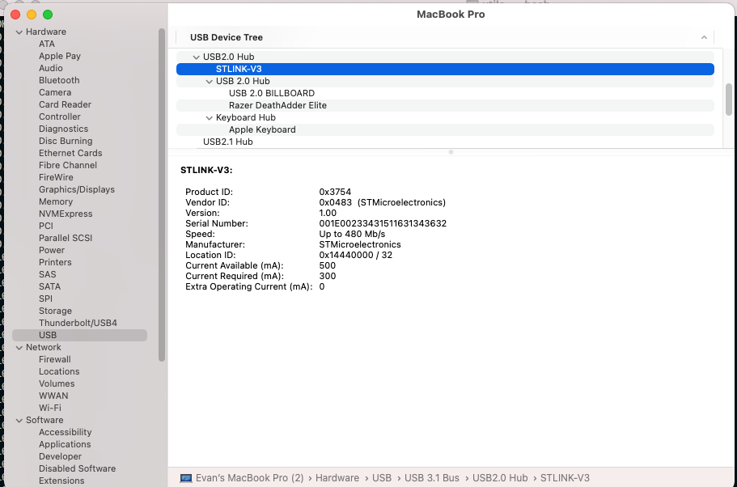

### Trick for dealing with multiple STLINKs at the same time, managing multiple node apps
Get the STLINK serial number:

eg: `001E00233431511631343632`
in the terminal window opened to my build directory of choice, set the STLINK_SERIAL environment variable:
`export STLINK_SERIAL=001E00233431511631343632`
then, any subsequent `make flash` will use the specified STLINK, rather than just picking the first one!
