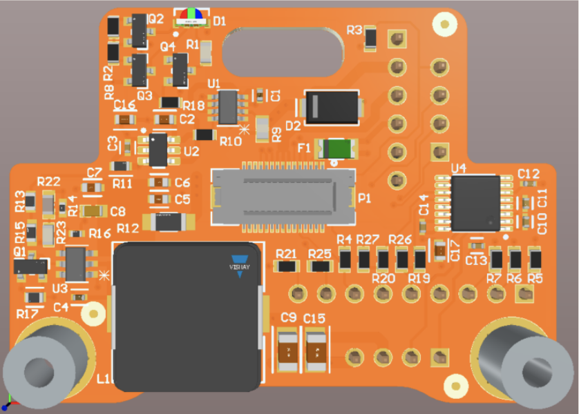

# Overview
The Bristleback is a prototype compact RS232 expander board compatible with Sofar Bristlemouth Motes.

The Bristleback contains a subset of the features of the Bristlemouth Development Board:
a 3.3V load switch to control power to its peripherals, an RS232 transceiver, a 9-18V DC output converter, a power monitor, and RGB LED.

# Getting Started
The Bristleback Apps are structured after the Bristlemouth Developer Kit Apps.
See [BMDK_README.md](../bm_devkit/BMDK_README.md) for general setup and development details.
Make the following changes when developing for the Bristleback:
- Add the Bristleback BSP cmake arg: `-DBSP=bm_mote_bristleback_v1_0`
- Add the Bristleback App type cmake arg: `-DCMAKE_APP_TYPE=bristleback`
-
For example: `cmake ../.. -DCMAKE_TOOLCHAIN_FILE=../../cmake/arm-none-eabi-gcc.cmake -DBSP=bm_mote_bristleback_v1_0 -DCMAKE_BUILD_TYPE=Debug -DCMAKE_APP_TYPE=bristleback -DAPP=serial_payload_example`

# Applications Overview
### Aanderaa
A development application for driving the Xylem Aanderaa family of single point Doppler current meters.

An additional build flag is required to select one of (3) currently supported types:
- `-DCMAKE_AANDERAA_TYPE=4830` (should be default if not sure)
- `-DCMAKE_AANDERAA_TYPE=BLUE` (was used for R&D)
- `-DCMAKE_AANDERAA_TYPE=FAKE_AANDERAA` (for testing without a sensor, generates random data)

### Serial Payload Example
A port of the Serial Payload Example App from the Bristlemouth Development Kit Apps.
